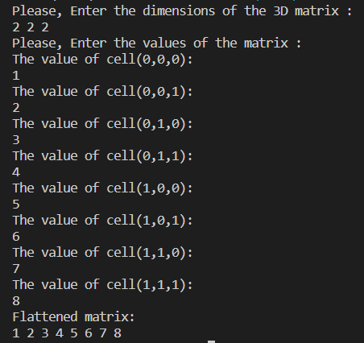

# Matrix-Flatten
Master Micro third task which is a matrix flattening from 3d to 1d.
## 🏁 Get Started <a name = "Install"></a>
### 1.Clone
```
git clone https://github.com/Ahmed-Emad10/Matrix-Flatten.git
```
### 2.Run
```
cd Matrix-Flatten
```
```
g++ main.cpp -o main
```
```
main
```
## 💻 Built Using <a name = "tech"></a>
- **C++**
## 📷 Screenshots

<div name="Screenshots" align="center">
  <h2 align='center'>Example</h2>
   </a>
   <hr>

   <h2 align='center'>Errors</h2>
   </a>
</div>


